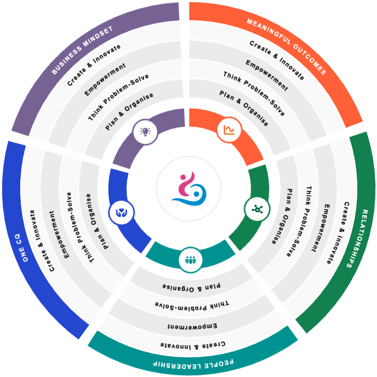

# Circular Diagram

A customizable React component for creating interactive circular diagrams with Fabric.js. Perfect for displaying organizational charts, competency models, or any hierarchical data in a visually appealing circular format.



## Features

- 🎨 **Fully Customizable** - Colors, icons, fonts, and styling
- 📱 **Responsive Design** - Adapts to different screen sizes
- 🖱️ **Interactive** - Click events and hover effects
- 🎯 **Multi-level Structure** - Support for nested items and categories
- 🚀 **Fabric.js Powered** - High-performance canvas rendering
- ⚡ **TypeScript Ready** - Full TypeScript support
- 🎪 **Easy Integration** - Simple React component

## Installation

```bash
npm install circular-diagram
```

Or with yarn:

```bash
yarn add circular-diagram
```

## Quick Start

```jsx
import React from 'react';
import CircularDiagram from 'circular-diagram';
import { v4 as uuidv4 } from 'uuid';

// Import your icons
import icon1 from './assets/icon1.png';
import icon2 from './assets/icon2.png';
import centerImage from './assets/center.png';

const data = [
  {
    id: uuidv4(),
    title: 'SECTION 1',
    color: '#FF6B35',
    icon: icon1,
    items: [
      {
        id: uuidv4(),
        label: 'Item 1',
        description: 'Description for item 1'
      },
      {
        id: uuidv4(),
        label: 'Item 2',
        description: 'Description for item 2'
      }
    ]
  },
  {
    id: uuidv4(),
    title: 'SECTION 2',
    color: '#2E8B57',
    icon: icon2,
    items: [
      {
        id: uuidv4(),
        label: 'Item 3',
        description: 'Description for item 3'
      }
    ]
  }
];

function App() {
  const handleSectionClick = (section) => {
    console.log('Clicked section:', section);
  };

  return (
    <div>
      <CircularDiagram
        CircularDiagramData={data}
        CenterImage={centerImage}
        onClick={handleSectionClick}
        fontFamily="Arial"
      />
    </div>
  );
}

export default App;
```

## API Reference

### Props

| Prop | Type | Required | Default | Description |
|------|------|----------|---------|-------------|
| `CircularDiagramData` | `Array<SectionData>` | ✅ | - | Array of section data objects |
| `CenterImage` | `string` | ✅ | - | URL or path to center image |
| `onClick` | `function` | ❌ | - | Callback function when a section is clicked |
| `fontFamily` | `string` | ❌ | `'Arial'` | Font family for text elements |

### Data Structure

#### SectionData

```typescript
interface SectionData {
  id: string;           // Unique identifier
  title: string;        // Section title (displayed on outer ring)
  color: string;        // Hex color for the section
  icon: string;         // URL or path to section icon
  items: ItemData[];    // Array of items in this section
}
```

#### ItemData

```typescript
interface ItemData {
  id: string;           // Unique identifier
  label: string;        // Item label (displayed in inner rings)
  description: string;  // Item description (for tooltips/info)
}
```

### Event Handlers

#### onClick(section)

Called when a user clicks on any interactive section.

**Parameters:**
- `section` (SectionData | ItemData): The clicked section or item data

**Example:**
```jsx
const handleClick = (section) => {
  if (section.items) {
    // It's a main section
    console.log('Main section clicked:', section.title);
  } else {
    // It's an item
    console.log('Item clicked:', section.label);
  }
};
```

## Styling

The component uses Fabric.js for rendering, which provides excellent performance and customization options. You can customize:

- **Colors**: Each section can have its own color
- **Icons**: PNG/JPG/SVG images for sections and center
- **Fonts**: Specify font family for text elements
- **Hover Effects**: Built-in darkening effect on hover

## Examples

### Organizational Chart

```jsx
const orgData = [
  {
    id: '1',
    title: 'LEADERSHIP',
    color: '#3498DB',
    icon: '/icons/leadership.png',
    items: [
      { id: '1-1', label: 'Strategic Vision', description: 'Long-term planning' },
      { id: '1-2', label: 'Team Building', description: 'Building strong teams' }
    ]
  },
  {
    id: '2',
    title: 'INNOVATION',
    color: '#E74C3C',
    icon: '/icons/innovation.png',
    items: [
      { id: '2-1', label: 'Creative Thinking', description: 'Out-of-box solutions' },
      { id: '2-2', label: 'Problem Solving', description: 'Analytical approach' }
    ]
  }
];
```

### Competency Model

```jsx
const competencyData = [
  {
    id: '1',
    title: 'TECHNICAL SKILLS',
    color: '#9B59B6',
    icon: '/icons/technical.png',
    items: [
      { id: '1-1', label: 'Programming', description: 'Software development' },
      { id: '1-2', label: 'Architecture', description: 'System design' }
    ]
  }
];
```

## Development

### Prerequisites

- Node.js 16+
- npm or yarn
- React 18+

### Setup

1. Clone the repository:
```bash
git clone https://github.com/miketropi/circular-diagram.git
cd circular-diagram
```

2. Install dependencies:
```bash
npm install
```

3. Start development server:
```bash
npm run dev
```

4. Build for production:
```bash
npm run build
```

### Project Structure

```
src/
├── components/
│   └── CircularDiagram.jsx    # Main component
├── util/
│   └── helpers.js             # Utility functions
├── App.jsx                    # Example usage
└── index.jsx                  # Library entry point
```

## Browser Support

- Chrome 88+
- Firefox 85+
- Safari 14+
- Edge 88+

## Dependencies

- React 18+
- Fabric.js 6.7+
- UUID 11+

## Contributing

1. Fork the repository
2. Create your feature branch (`git checkout -b feature/AmazingFeature`)
3. Commit your changes (`git commit -m 'Add some AmazingFeature'`)
4. Push to the branch (`git push origin feature/AmazingFeature`)
5. Open a Pull Request

## License

This project is licensed under the MIT License - see the [LICENSE](LICENSE) file for details.

## Changelog

### v0.0.1
- Initial release
- Basic circular diagram functionality
- Fabric.js integration
- Interactive hover and click events
- Customizable colors and icons

## Support

If you have any questions or need help, please:

1. Check the [documentation](#api-reference)
2. Look at the [examples](#examples)
3. Open an [issue](https://github.com/miketropi/circular-diagram/issues)

## Author

**Mike Tropi**
- GitHub: [@miketropi](https://github.com/miketropi)

---

Made with ❤️ using React and Fabric.js